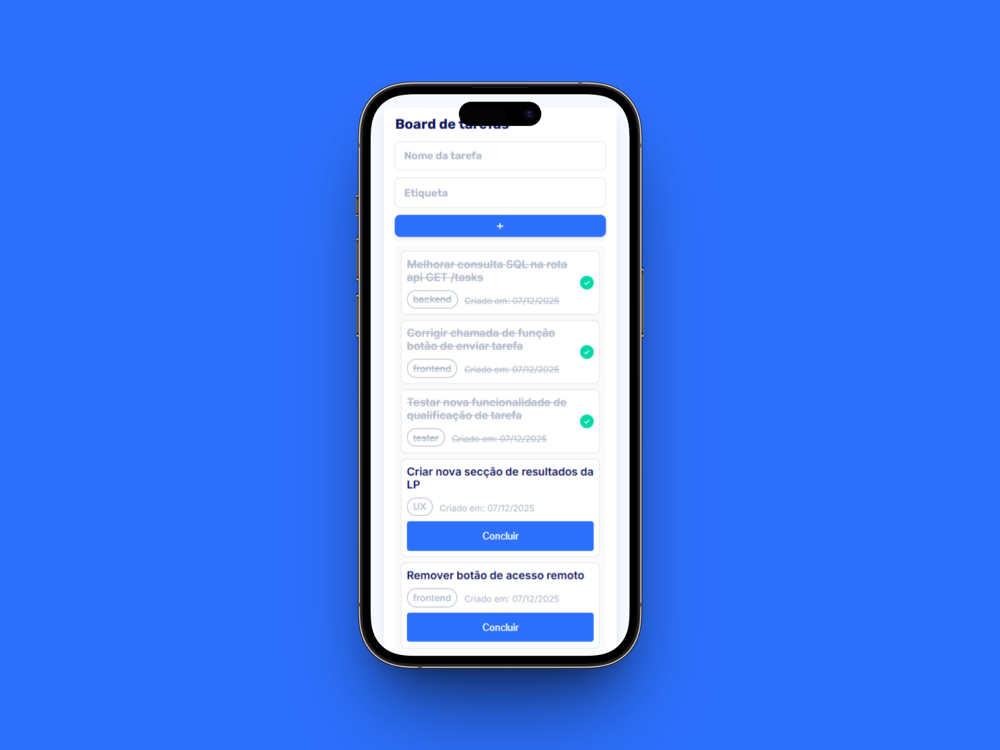
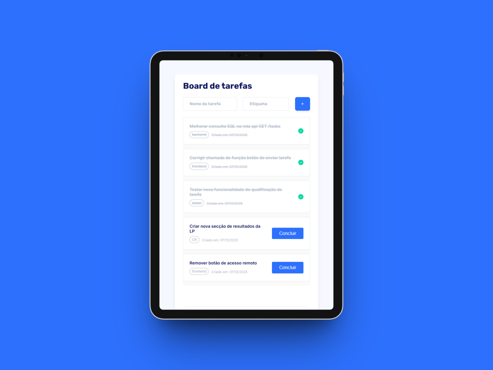
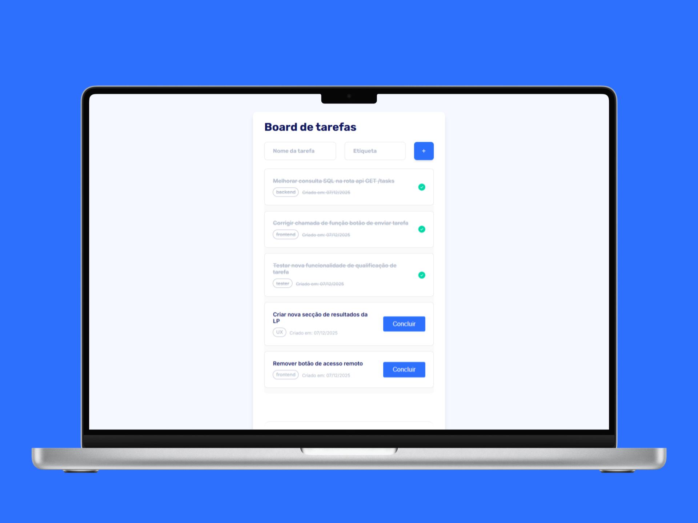

# 📋 Board de Tarefas - To Do App

Uma aplicação web moderna e responsiva para gerenciamento de tarefas com persistência local. Desenvolvida seguindo metodologia **mobile-first** com HTML5, CSS3 e JavaScript vanilla.

---

## ✨ Funcionalidades

- ✅ **Adicionar Tarefas** - Criar novas tarefas com nome e etiqueta personalizadas
- ✅ **Marcar como Concluída** - Alternar status de conclusão com feedback visual
- ✅ **Persistência Local** - Salvamento automático em localStorage
- ✅ **Contador Dinâmico** - Exibição automática de tarefas concluídas com pluralização
- ✅ **Interface Responsiva** - Experiência otimizada para mobile, tablet e desktop
- ✅ **Animações Fluidas** - Transições suaves em interações
- ✅ **Scroll Dinâmico** - Altura da página cresce conforme o número de tarefas
- ✅ **Input com Enter** - Adicionar tarefas pressionando Enter nos campos de entrada
- ✅ **Design Intuitivo** - Interface clean e acessível com fontes personalizadas (Rubik, Inter)

---

## 🏗️ Estrutura do Projeto

```
RID222165_Desafio03/
│
├── index.html              # Marcação semântica do aplicativo
├── style.css               # Sistema de estilos com CSS custom properties
├── script.js               # Lógica de negócio e DOM manipulation
├── README.md               # Este arquivo
│
└── assets/
    ├── +.svg              # Ícone botão adicionar
    ├── Checked.png        # Ícone tarefa concluída
    ├── ToDoApp_Mobile.png    # Screenshot mobile (360px)
    ├── ToDoApp_Tablet.png    # Screenshot tablet (768px)
    └── ToDoApp_Desktop.png   # Screenshot desktop (1200px)
```

### Arquivos Principais

#### **index.html**

- Estrutura semântica com tags `<section>`, `<div>`, `<ul>`, `<li>`
- Elementos controlados dinamicamente via JavaScript
- Meta tags responsivas e preconexão com Google Fonts
- Formulário acessível com inputs nomeados

#### **style.css** (529 linhas)

- **CSS Custom Properties** para tema reutilizável
- **Grid de Cores** - Paleta de 11 cores base
- **Sistema de Espaçamento** - Variáveis xs/sm/md/lg/xl
- **Tipografia** - Rubik para títulos, Inter para corpo de texto
- **Media Queries** em 768px (tablet) e 480px (mobile)
- **Animações** - slideIn, fadeIn, slideOut com transições suaves
- **Estados** - Hover, active, completed, icon-only para botões

#### **script.js** (257 linhas)

- **Estrutura de Dados** - Array `tasks` com objetos {id, name, tag, isComplete, createdAt}
- **Funções de Persistência** - localStorage com try-catch para segurança
- **CRUD Operations** - addTask, updateTask, renderTasks, updateTaskCounter
- **Event Listeners** - Click em botões e Enter em inputs
- **Inicialização** - initApp() que carrega dados e renderiza interface

---

## 💻 Tecnologias e Metodologias de Desenvolvimento

### **Frontend Stack**

| Tecnologia            | Versão    | Uso                                |
| --------------------- | --------- | ---------------------------------- |
| **HTML5**             | Semântico | Estrutura markup                   |
| **CSS3**              | Modern    | Estilos, animações, responsividade |
| **JavaScript (ES6+)** | Vanilla   | Lógica e DOM manipulation          |
| **Google Fonts**      | API       | Tipografia (Rubik, Inter)          |

### **Padrões e Boas Práticas**

- 📱 **Mobile-First** - Desenvolvido inicialmente para mobile (480px), escalando para tablet (768px) e desktop (1200px)
- 🎨 **Design System** - CSS Custom Properties para manutenção centralizada de cores, espaçamentos e tipografia
- 🏛️ **Arquitetura Simples** - Sem dependências externas, apenas vanilla JavaScript
- 📝 **Código Documentado** - JSDoc comments em todas as funções principais
- ♿ **Acessibilidade** - Labels semânticas, atributos alt em imagens, estados visuais claros
- 🔒 **Segurança** - Try-catch em operações localStorage, validação de inputs

### **Metodologia de Desenvolvimento**

#### **1. Mobile-First Responsive Design**

```css
/* Base: Mobile (480px) */
.task-item {
  padding: 0.5rem;
  gap: 0.5rem;
}

/* Tablet (768px) */
@media (max-width: 768px) {
  .task-item {
    padding: 1rem;
  }
}

/* Desktop (1200px) */
/* Sem alterações adicionais, usa a base tablet */
```

#### **2. CSS Custom Properties (Variáveis)**

```css
:root {
  --primary-color: #6366f1;
  --spacing-md: 1.5rem;
  --radius-md: 0.5rem;
}

/* Aplicação */
.btn-primary {
  background-color: var(--primary-color);
  padding: var(--spacing-md);
}
```

#### **3. Fluxo de Dados**

```
DOM (inputs)
    ↓
addTask() → cria objeto task
    ↓
setTasksInLocalStorage() → persiste dados
    ↓
renderTasks() → atualiza DOM
    ↓
updateTaskCounter() → exibe contador
```

#### **4. Tratamento de Erros**

```javascript
function getTasksFromLocalStorage() {
  try {
    const stored = localStorage.getItem("tasks");
    return stored ? JSON.parse(stored) : [];
  } catch (error) {
    console.error("Erro ao recuperar tarefas:", error);
    return [];
  }
}
```

---

## 📸 Demonstração Visual

### **Mobile (360px)**



_Interface otimizada para celulares com:_

- Layout vertical compacto
- Inputs em coluna única
- Botão "Concluir" em largura total
- Contador em baixo da página com scroll

### **Tablet (768px)**



_Experiência intermediária com:_

- Inputs em linha com spacing ajustado
- Botão em tamanho apropriado
- Melhor utilização de espaço horizontal

### **Desktop (1200px)**



_Interface completa com:_

- Layout fluído com padding 24px 32px
- Input group com espaçamento 24px entre elementos
- Botão com dimensões especificadas (121px × 44px)
- Scrollable tasks container com altura dinâmica
- Contador fixo na parte inferior com scroll natural

---

## 🚀 Como Usar

1. **Abrir no navegador**

   ```
   Clique em index.html ou abra em um servidor local
   ```

2. **Adicionar Tarefa**

   - Digite o nome da tarefa
   - Digite a etiqueta
   - Clique no botão `+` ou pressione `Enter`

3. **Marcar como Concluída**

   - Clique no botão "Concluir"
   - O texto ficará riscado e um ícone ✓ aparecerá
   - O contador será atualizado automaticamente

4. **Verificar Persistência**
   - Atualize a página
   - As tarefas serão carregadas do localStorage
   - O estado é mantido entre sessões

---
